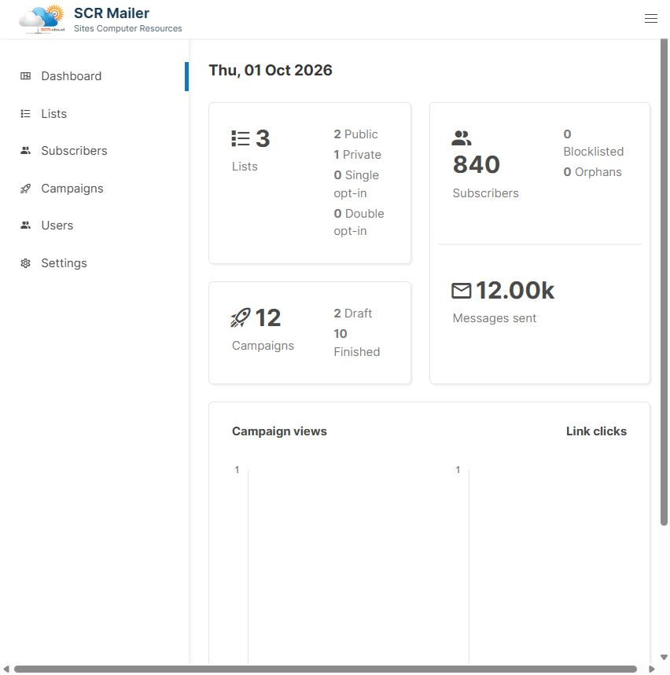

# Introduction

SCR Mailer is a self-hosted, high performance one-way mailing list and newsletter manager. It comes as a standalone binary and the only dependency is a Postgres database.

## Developers
SCR Mailer is a free and open source software licensed under AGPLv3. If you are interested in contributing, check out the [GitHub repository](https://github.com/sitescomputer/SCR-Mailer) and refer to the [developer setup](developer-setup.md). The backend is written in Go and the frontend is Vue with Buefy for UI.

The dashboard preview above uses sample data. See [upstream attribution](https://github.com/sitescomputer/SCR-Mailer/blob/master/UPSTREAM.md).
